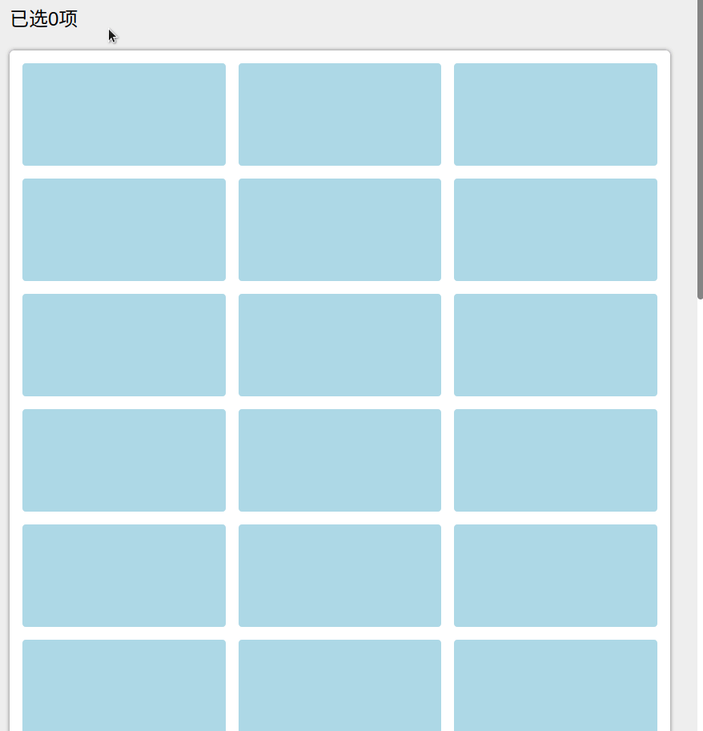

TCS Rubberban
====

JS的实现框选效果，**这不是一个library，这只是一个实现demo**



### 使用方式
1. 克隆项目到本地
    ```shell
    git clone https://github.com/hungtcs-lab/tcs-rubberband.git
    ```
2. 切换到项目目录
    ```shell
    cd tcs-rubberband
    ```
3. 安装npm依赖，接着启动项目
    ```shell
    npm install
    npm start
    ```
4. 使用浏览器访问，默认端口为`3100`
